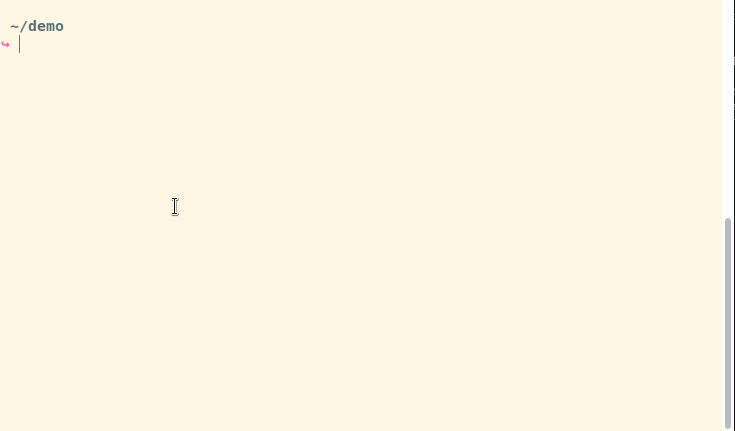
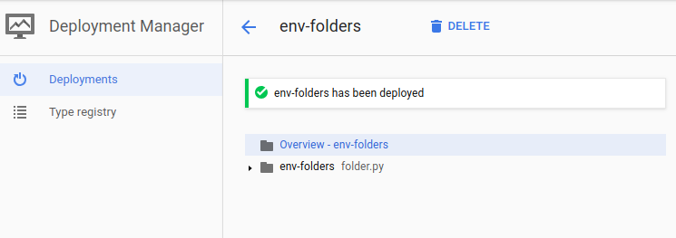
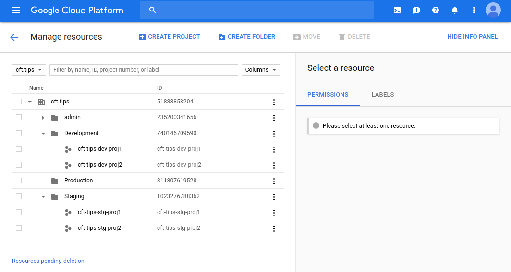

# Getting Started - The Basics

This is a series of tutorials to help you get started using these templates. At the end of the tutorial you should be able to understand, utilize and customize the templates to your own needs.

In this tutorial we will create a simple Organization Resource Hierarchy with folders and projects.

Feel free to contribute;

## Pre-required knowledge

Familiarity with:
* YAML files general structure
* Deployment manager concepts
* Familiarity with CLI
* Familiarity with `gcloud`

## ... But first!

Let's take a deeper look at our template structure to understand how the folder hierarchy is organized. The templates are hosted under the [Deployement Manager Samples repository](https://github.com/GoogleCloudPlatform/deploymentmanager-samples).

In the `templates` folder you'll find all templates for the different resources within Google Cloud Platform, these are continuously being expanded and improved.

The general anatomy of a template is the following 

```shell
template_name/
├── examples/
│   ├── example1.yaml
│   └── example2.yaml
├── tests/integration/
│   ├── template_name.bats
│   └── template_name.yaml
├── template_name.py
├── template_name.schema
└── README.md
```

* The `README.md` contains the instructions to setup your environment to use the given template, it generally points any pre-requisit work and required premissons on APIs to successfully run the template.

* The most common usage examples are in the `example` folder, those consist of the YAML file(s)  that serve as input to the templates. When the example requires a resource to be created in order to run you will find a `<FIXME>` tag in the example indicating the information of a pre-required resource is needed to successfully run the template.

* The `tests` folder contain the validation integration tests created, those make use of the bats framework and instructions to setup your environment to run these can be found at the [testing.md](../testing.md) file.

* The Python file contains the template logic, sometimes you may find multiple python files under a template, those generally represent subset within the resource that make sense to create separately; Example: `bigquery_table.py` and `bigpquery_dataset.py` under the `bigquery` template folder.

* The Schema file contains the properties the template can accept, these use the underlying mechanisms of deployment manager, however the schema file also defines several default values that are used to allow a parameter to be omitted; 

## Quick glance at *.schema file

Schema files are YAML files with generally the following structure:

```shell
info:
  title: my template
  author: me
  description: |
   my template description

imports:
  - path: path/to/template.py

required:
  - property_name

properties:
  property_name:
    type: string
    description: |
      my property name!

outputs:
  properties:
    - property_name:
        type: string
        description: my property name output.

documentation:
  - path/to/README.md

examples:
  - path/to/examples.yaml
```

Key highlights:

* The `info` object contain general metadata about the template.
* The `required` object contain the fields that are mandatory input for the template to successfully run.
* The `properties` object contain the properties definitions (with their default values, when applicable) that the template accepts.
* The `outputs` object are the fields exposed as a deployment manager output, these can be visualized in the web console by viewing the template `layout`.

## How does it work?

We should briefly talk about how the resources get created.

* Step 1: The user/system calls Deployment Manager (DM) passing the template as input, in this initial step the account in use is the user/system identity.
* Step 2: DM parses the input (among other things) and then triggers the actions specified in the template to create or update the resources.
* Step 3: The DM service executes the template action using it's own service account identity
* Step 4: The resources API respond to DM with the status of the operation and DM responds back to the user.


```shell
User/System +--------> Deployment +--------> Deployment Manager +--------> Resource
  Account       ^       Manager               Service Account        ^     Updated
                |                                                    |
                |                                                    |
                +                                                    +

               IAM                                                  IAM
           Premissions                                          Premissions
```

## Setting up a simple ORG Hierachy

Ok, now that basic concepts are out of the way lets build something fun, we will create the folders and projects under our organization node as follows:

```shell
                        +------------------+
                        |                  |
             +----------+   Organization   +-----------+
             |          |                  |           |
             |          +---------+--------+           |
             |                    |                    |
             |                    |                    |
             v                    v                    v
      +------+------+       +-------------+     +------------+
      |     Prod    |       |   Staging   |     |    Dev     |
  +---|    Folder   |--+    |   Folder    |     |   Folder   |
  |   +------+------+  |    +-------------+     +------------+
  |          |         |     |      |     |     |      |     |
  |          |         |     |      |     |     v      v     v
  v          v         v     |      |     |  Proj1   Proj2  Proj3
Proj1      Proj2    Proj3    |      |     |
                             v      v     v
                          Proj1  Proj2  Proj3

```

ASCII diagrams FTW! =P

### Configuring Project Creator

As you know, `folders` and `projects` are a Organization resource, for creating those with deployment manager we first need to create a special project setup that contains the necessary privileges to setup folders and projects.

Before you continue; here are the prerequisites:

* Have your Organization created in GCP.
* Have your admin user created and configured.
* Have your billing account created and configured.

Then execute the following steps:

1. Create a new project, optionally within a Folder.
2. Set the billing account for the new project.
3. Turn on the required set of APIs.

```shell
    gcloud services enable deploymentmanager.googleapis.com
    gcloud services enable cloudresourcemanager.googleapis.com
    gcloud services enable cloudbilling.googleapis.com
    gcloud services enable iam.googleapis.com
    gcloud services enable servicemanagement.googleapis.com
```

4. Assign the proper IAM roles to the Deployment Manager service account.
5. Optionally, run a deployment test by either creating a [folder](../../templates/folder/README.md) or a [project](../../templates/project/README.md).

The below shows those 5 steps being executed:


It's important to note that your project must be globally unique for this to work; therefore it's recommended that you either put your Org name as a prefix or add a random number suffix if you are unsure the requiremnt is met.

Also, note how the deployment manager service account is granted Project Creator and Folder Admin permissions at the Org level since we want to be able to create Folders and Projects.

Finding the Deployment Manager Service Account (let's call it DM-SA) is simple, look for the service account address, it's labeled with a **Cloud Services** prefix to the service account domain and has the project number as the identity. Here is an example: `1230123456789@cloudservices.gserviceaccount.com` typically with the name of `Google APIs Service Agent` [More info.](https://cloud.google.com/iam/docs/service-accounts?&_ga=2.8784828.-842298576.1540643080#google-managed_service_accounts)

### Creating our YAML configuration

To build our YAML file we first need to import the templates we need, you might choose to use a `symlink` or simply copy the contents of the template to your configuration folder.

Create a folder and place the templates in it; copy the folder.yaml example so we can use it as a baseline:



Now that you have your environment ready let's create our configuration file, under our Org we want to create 3 folders called `production`, `development`, `staging`.

First thing we have to do is import the template we want to follow:

```yaml
imports:
- path: templates/folder/folder.py
  name: folder.py
```

Then we need to define our resources object, where we will indicate the name the object we are creating for deployment manager `resources.name` and the type of the resource which should point to our imported template name.

```yaml
resources:
- name: env-folders
  type: folder.py
```



Once we defined the type and the name of our resources all we have left is define the properties for our folders. This is what one folder configuration looks like:

```yaml
      - name: production
        orgId: organizations/102938475619
        displayName: Production
```

The configuration is passed as part of the folders object within property, which contains an array of folders. This is what the YAML looks like with the our 3 folder:

```yaml
imports:
- path: templates/folder/folder.py
  name: folder.py
resources:
- name: env-folders
  type: folder.py
  properties:
    folders:
      - name: production
        orgId: organizations/102938475619
        displayName: Production
      - name: development
        orgId: organizations/102938475619
        displayName: Development
      - name: stating
        orgId: organizations/102938475619
        displayName: Staging
```

Don't forget to update the Org ID to match your organization.

At this point we can go ahead and create our folders to test our setup; save the YAML in a file called `folder-hierarchy.yaml` and pass it to deployment manager as input for the resource creation job.

```shell
gcloud deployment-manager deployments create env-folders --config folder-hierarchy.yaml
```
Which should yield the following result:


Now we would like to create `proj1`, `proj2` and, `proj3` under our 3 folders, for that purpose import the project template in the imports section and add a new item under the resources object.

Note that a project and its resources must be in its own YAML file; here is the most minimalistic project we can build:

```yaml
imports:
  - path: templates/project/project.py
    name: project.py

resources:
  - name: cft-tips-proj1
    type: project.py
    properties:
      parent:
        type: folder
        id: 740146709590
      billingAccountId: 123456-7890BD-CAFE04
      removeDefaultVPC: False
      removeDefaultSA: False
```

When in doubt of what the fields mean check the [project.py.schema](../../templates/project/project.py.schema) file for reference; 

Notewhorty items:

* The `name` field reflects as project ID and must be globally unique.
* The Default VPC and Service Account are removed by default by the project template.
* The configuration above requires the DM-SA to have `Billing Account User` IAM role.
* In case you are enabling APIs along with the project creation ensure to give the DM-SA the proper IAM rights to execute that action.



These cover the basics to the getting started guide.
